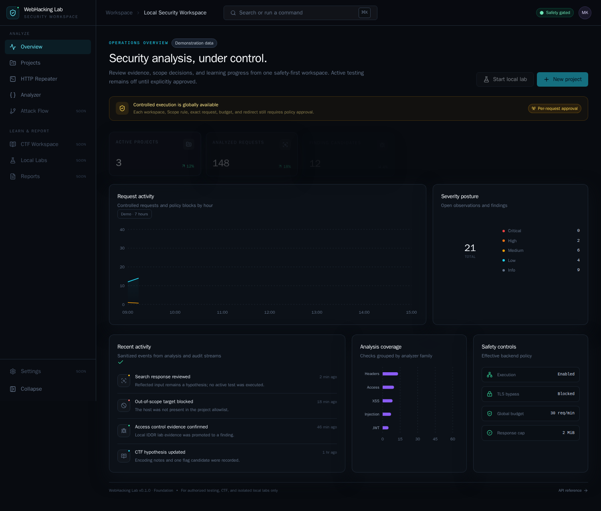
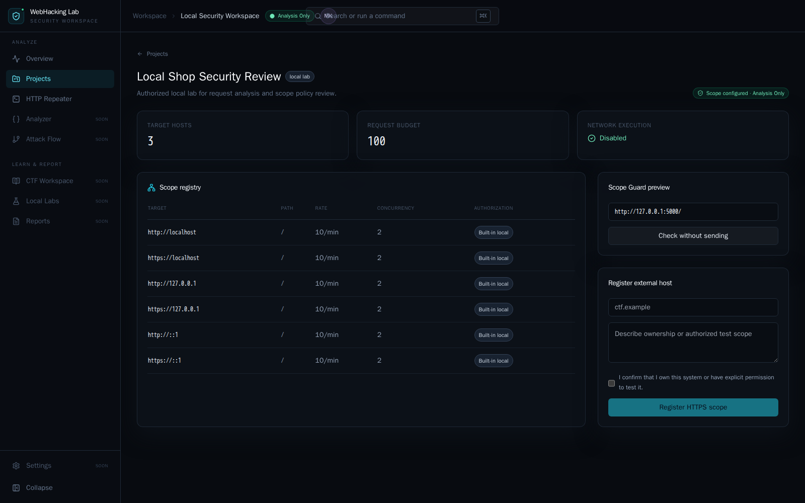
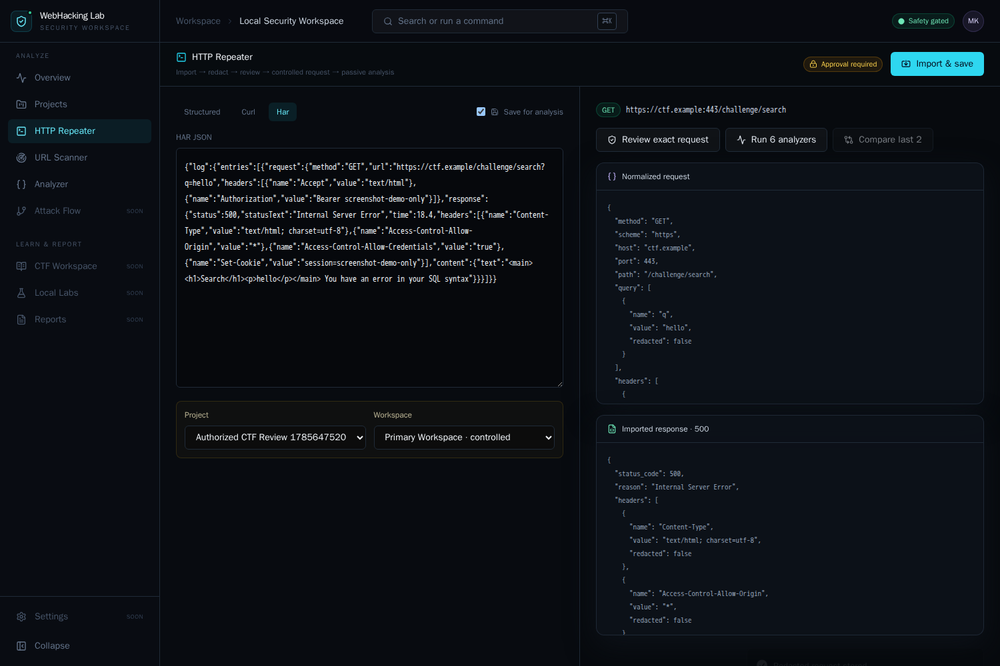
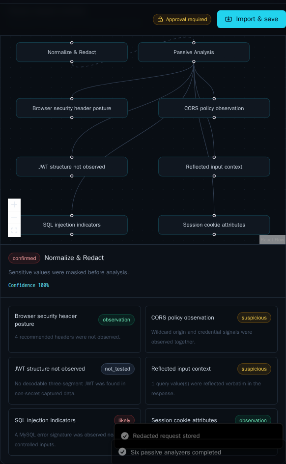
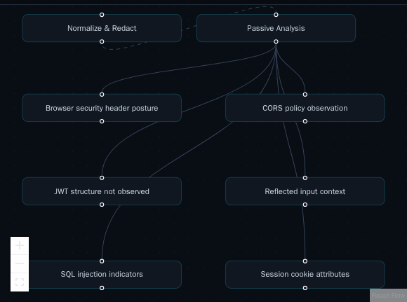
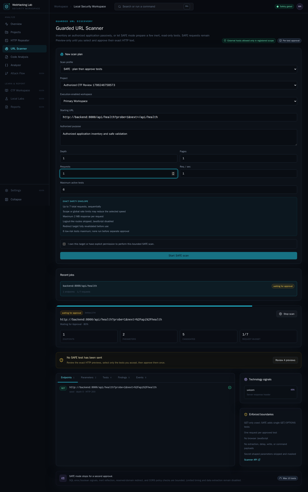
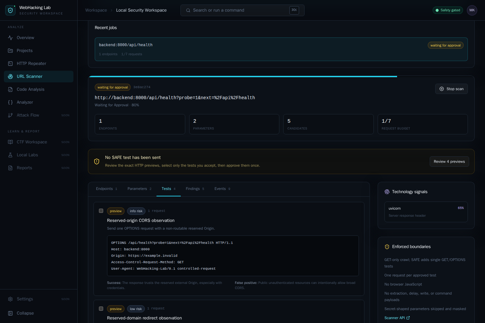
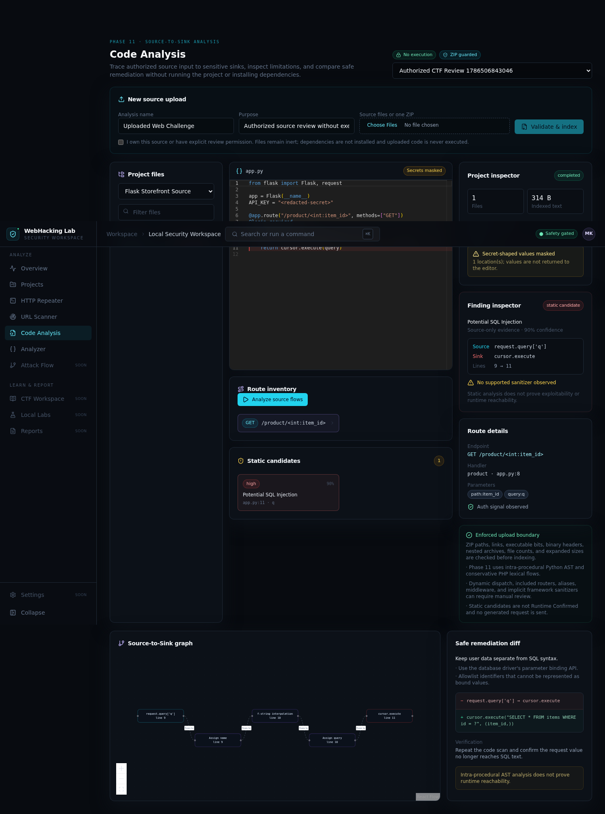
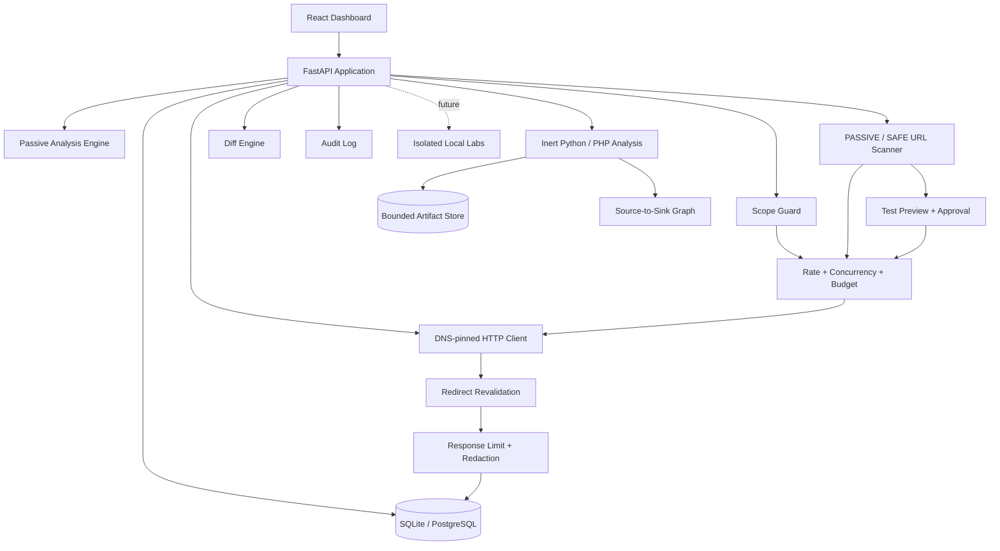
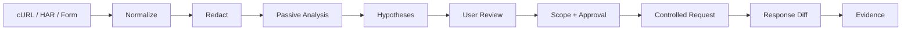

# WebHacking Lab

CTF, 로컬 랩, 명시적으로 허가받은 모의해킹의 HTTP 증거를 한곳에서 분석하는 안전 중심 웹 보안 워크스페이스입니다.

요청·응답 정규화, 민감정보 마스킹, Scope 관리, 제한적 외부 요청, 응답 Diff, 6개 수동 분석기, React Flow 분석 흐름, **승인형 SAFE URL Scanner**와 **실행 없는 Python/PHP Source-to-Sink 분석**이 실제 FastAPI 데이터로 동작합니다.

> 기본값은 **Analysis Only**입니다. 외부 요청은 서버 설정, 프로젝트 Scope, 권한 확인, 워크스페이스 승인, 요청별 최종 확인을 모두 통과해야 합니다.



| 외부 Scope와 실행 승인 | Repeater와 정확한 요청 확인 |
| --- | --- |
|  |  |

| 수동 분석 결과 | React Flow 분석 흐름 |
| --- | --- |
|  |  |

| Scope 기반 URL Scanner | 정확한 SAFE 요청 개별 승인 |
| --- | --- |
|  |  |



## 빠른 시작

Docker와 Docker Compose v2만 있으면 됩니다.

```bash
git clone https://github.com/MintKangaroo/WebHacking_Lab.git
cd WebHacking_Lab
cp .env.example .env
docker compose up --build
```

- 앱: <http://localhost:8080>
- API 문서: <http://localhost:8080/api/docs>
- 상태 확인: <http://localhost:8080/api/health>

종료:

```bash
docker compose down
```

포트가 겹치면 `.env`의 `WEBHACKING_FRONTEND_PORT=28080`만 변경하세요.

## 가장 쉬운 사용법

### 1. 요청을 보내지 않고 분석하기

1. **Projects**에서 프로젝트를 만듭니다.
2. **HTTP Repeater**에서 cURL 또는 HAR를 붙여넣습니다.
3. 미리보기만 필요하면 **Import safely**를 누릅니다.
4. 분석 기록을 남기려면 **Save for analysis**를 켜고 프로젝트와 워크스페이스를 고릅니다.
5. **Run 6 analyzers**로 Security Header, CORS, JWT, XSS reflection, SQL error indicator, Cookie 설정을 확인합니다.
6. 응답이 2개 이상이면 **Compare last 2**로 상태·헤더·JSON·HTML·크기·시간·에러 패턴을 비교합니다.

예제:

```bash
curl 'http://127.0.0.1:5000/search?q=demo' \
  -H 'Authorization: Bearer demo-token'
```

cURL은 명령으로 실행되지 않고 데이터로만 파싱됩니다. `Authorization`, Cookie, API Key, 토큰 계열 값은 저장 전에 `[REDACTED]` 처리됩니다. 키 이름뿐 아니라 JWT·`Bearer`/`Basic` 자격증명·고엔트로피 토큰 등 값의 형태로도 마스킹하므로, 비민감 키나 평문 본문에 섞인 시크릿도 걸러집니다.

### 2. 허가받은 외부 호스트에 제한적으로 요청하기

먼저 `.env`에서 두 값을 명시적으로 바꾼 뒤 앱을 다시 빌드합니다.

```dotenv
WEBHACKING_ANALYSIS_ONLY=false
WEBHACKING_NETWORK_EXECUTION_ENABLED=true
```

```bash
docker compose up --build
```

그다음 UI에서 다음 순서로 진행합니다.

1. **Projects**에서 `Authorized Pentest` 또는 `CTF` 프로젝트를 만듭니다.
2. **Register external host**에 `scheme`, `hostname`, 선택적 `port`, `path`를 입력합니다.
3. 권한과 범위를 설명하고 소유권/테스트 권한 확인란을 선택합니다.
4. **Controlled request approval**에 사용 목적을 적고 워크스페이스 실행을 활성화합니다.
5. Repeater에서 `GET`, `HEAD`, `OPTIONS` 요청을 저장합니다.
6. **Review exact request**로 실제 전송될 요청, Scope 결과, 최대 요청 수, 예상 영향을 확인합니다.
7. 최종 확인란을 선택한 뒤 **Send controlled request**를 누릅니다.

현재 외부 실행은 다음 경계를 강제합니다.

- `GET`, `HEAD`, `OPTIONS`만 허용하고 body는 전송하지 않음
- 저장된 Authorization, Cookie, API Key와 민감 Query 값을 재전송하지 않음
- 실제 연결을 Scope Guard가 승인한 DNS IP에 고정
- 리다이렉트마다 scheme, host, port, path, DNS/IP, Scope를 다시 확인
- HTTPS에서 HTTP로 내려가는 리다이렉트 차단
- 승인 1회당 최대 5개 요청, 전역/대상별 rate limit과 동시성 제한
- 워크스페이스 요청 예산, timeout, 요청별 최대 응답 크기 적용
- TLS 인증서 검증을 항상 사용하고 환경 proxy를 사용하지 않음
- 성공·실패·정책 차단을 감사 로그에 기록

공격 페이로드 실행, 로그인 brute force, 데이터 추출, 파일 쓰기, 명령 실행은 제공하지 않습니다.

### 3. URL을 안전하게 자동 탐색하기

외부 호스트도 사용할 수 있지만, 반드시 위의 **외부 Scope 등록**과 **워크스페이스 실행 승인**을 먼저 완료해야 합니다.

1. 좌측 **URL Scanner**를 엽니다.
2. 실행 승인이 끝난 프로젝트와 워크스페이스를 선택합니다.
3. 등록된 Scope 안의 시작 URL을 입력합니다.
4. `PASSIVE`, `SAFE`, (CTF 모드가 켜진 경우) `CTF` 중 하나를 선택합니다. 처음에는 `Depth 1 / Pages 10 / Requests 10 / 1 req/s`를 권장합니다.
5. 승인된 사용 목적을 적고 권한 확인란을 선택합니다.
6. **Start PASSIVE scan** / **Start SAFE scan** / **Start CTF scan**을 누릅니다.
7. Endpoint, Parameter, Finding, Policy Event를 확인합니다. 필요하면 **Stop scan**으로 중단합니다.
8. SAFE는 자동 실행되지 않고 **Waiting for Approval**에서 멈춥니다.
9. **Tests**에서 정확한 HTTP 요청, 목적, 위험, 성공 기준, 오탐 가능성을 읽고 필요한 항목만 선택합니다.
10. **Approve selected tests**를 누르면 선택한 단일 요청만 기존 Scope Guard를 통해 실행됩니다.

Scanner가 자동으로 확인하는 범위:

- HTML link, form, iframe, script source
- 정적 JavaScript의 `fetch`, Axios, XMLHttpRequest, WebSocket URL 문자열
- `robots.txt`, `sitemap.xml`, OpenAPI/Swagger 문서
- Query, Form, JSON, Multipart parameter inventory
- 서버/프레임워크 단서, Security Header, CORS, Cookie, JWT, XSS 반사, SQL 오류 지표

`PASSIVE`는 GET 기반 수집만 합니다. `SAFE`는 수집 후 최대 10개의 낮은 위험 테스트를 Preview로 만들며, 사용자가 개별 승인하기 전에는 한 건도 보내지 않습니다. 현재 SAFE 플러그인은 SQL 오류·숫자형 boolean 차이, 실행 불가능한 XSS 반사 marker, 따라가지 않는 예약 도메인 redirect, 단일 CORS OPTIONS 관찰을 지원합니다. 시간 지연, 데이터 추출, 파일/DB 쓰기, 명령 실행, JavaScript 실행, 로그인 자동화는 비활성화되어 있습니다.

#### CTF 프로필: URL만 붙여넣고 스캔하기

CTF 대회처럼 이미 대상 권한이 있을 때는 승인 절차를 생략하는 `CTF` 프로필을 쓸 수 있습니다. 서버에서 `WEBHACKING_CTF_MODE_ENABLED=true`(그리고 `WEBHACKING_NETWORK_EXECUTION_ENABLED=true`)를 설정하면 URL Scanner에 `CTF` 옵션이 나타납니다.

`CTF` 프로필은 게이트를 전면 완화합니다.

- 붙여넣은 시작 URL의 호스트를 **인가된 Scope 규칙으로 자동 등록**합니다.
- 해당 워크스페이스의 **네트워크 실행을 자동 활성화**합니다.
- 계획된 read-only 프로브를 **자동 승인**하고 별도 확인 없이 **무인 실행**합니다.

CTF 액티브 플러그인은 실제 탐지 페이로드를 보냅니다: SQL 오류/UNION/boolean 프로브, `<script>` 반사 marker XSS, `/etc/passwd` 경로 탐색, 예약 호스트 open redirect. 각 프로브는 **단일 GET 한 건**이며 쿼리 파라미터 하나만 치환하고, 요청 본문·자격증명을 재전송하지 않습니다. `DROP`/`DELETE`/`SLEEP`/`INTO OUTFILE` 등 상태를 변경·지연·삭제하는 값은 CTF 비파괴 정책이 계속 차단합니다.

완화되는 것은 **인가·승인 절차뿐**입니다. Scope Guard의 SSRF 방어(HTTP(S)-only, userinfo 차단, DNS 응답 IP 검사, **cloud metadata·link-local·multicast·reserved·unspecified 대역 차단**), 민감정보 마스킹, 전역·Scope 레이트 리밋, 감사 로그는 그대로 적용됩니다.

> **주의 — 사설/loopback 대역은 차단되지 않습니다.** Scope Guard는 내부대역 denylist가 아니라 **allowlist(Scope 규칙 기반)**로 동작합니다. `10.0.0.0/8`, `172.16.0.0/12`, `192.168.0.0/16` 같은 RFC1918 사설 IP와 `127.0.0.1` loopback은 IP 정책에서 차단되지 않으며, Scope 규칙에 등록되면(로컬 랩) 또는 CTF 프로필에서 붙여넣으면(자동 등록) 도달 가능합니다. 이는 로컬 랩과 HackTheBox류 VPN 대상(`10.10.x.x`)을 지원하기 위한 **의도된 동작**입니다. 따라서 CTF 프로필에 **내부 주소를 붙여넣으면 추가 확인 없이 해당 내부 호스트로 read-only 프로브가 무인 발사**됩니다. 본인이 소유했거나 명시적 허가를 받은 대상에만 사용하세요.

### 4. 소스코드를 실행하지 않고 구조 분석하기

1. 좌측 **Code Analysis**를 엽니다.
2. 상위 프로젝트를 고르고 분석 이름과 권한 있는 검토 목적을 입력합니다.
3. 여러 소스 파일 또는 ZIP 하나를 선택하고 권한 확인란을 선택합니다.
4. **Validate & index**를 누르면 ZIP/파일 안전 검사 후 텍스트 파일만 인덱싱됩니다.
5. 파일 트리에서 마스킹된 코드를 읽고 **Analyze source flows**를 누릅니다.
6. Route Inventory에서 endpoint를 선택하면 Monaco Editor가 연결된 파일과 라인으로 이동합니다.
7. **Static candidates**에서 후보를 고르면 Source와 Sink 라인이 강조되고 하단 그래프에 데이터 흐름이 표시됩니다.
8. 우측에서 sanitizer, 신뢰도, 분석 한계를 확인하고 **Safe remediation diff**의 수정 예시로 검토합니다.

업로드한 코드는 import, 실행, build되지 않으며 dependency install이나 HTTP 요청도 수행하지 않습니다. ZIP Slip, symbolic/hard link, 실행 비트·실행 파일, 중첩 압축, 확장자/MIME과 바이너리 header, 파일 수, 개별/전체 크기를 검사합니다. 원본 파일은 UUID 아티팩트 디렉터리에 저장되고 DB에는 파일 해시와 인덱스만 저장합니다. API Key, token, password, private key 형태는 Editor 응답에서 마스킹됩니다.

현재 정적 분석은 Python AST로 Flask 요청 입력과 SQL, template, command, file, raw HTML sink를 추적하고, Plain PHP에서는 superglobal 입력과 SQL, command, include, raw output sink를 보수적으로 연결합니다. 변수 할당·문자열 결합·f-string·일부 sanitizer를 고려하지만 함수 간·동적 dispatch 전체를 해석하지 않으므로 결과는 항상 `Static Candidate`이며 런타임 확인으로 승격하지 않습니다.

## 현재 기능

- 프로젝트, 워크스페이스, 요청 예산, optimistic locking
- loopback 기본 Scope와 권한 확인이 필요한 외부 Scope
- SSRF 방지 정책: Scope allowlist + HTTP(S)-only/userinfo 차단 + DNS 응답 IP 검사로 metadata·link-local·multicast·reserved·unspecified 대역 차단 (사설/loopback은 allowlist·CTF 등록 시 도달 가능 — 위 CTF 프로필 주의 참고)
- DNS-pinned HTTPX 클라이언트와 리다이렉트 재검사
- cURL/HAR 가져오기, Raw/구조화 HTTP 정규화, multimap 보존
- 헤더·Cookie·Query·JSON/Form 본문·감사 로그 마스킹
- 요청 Revision, 응답 증거, 감사 이벤트 저장
- UUID/timestamp/nonce/CSRF 노이즈를 줄이는 Response Diff
- JSON path ignore, CSS selector ignore, 사용자 정규식 ignore
- 6개 passive analyzer와 `Observation / Suspicious / Likely / Not Tested` 구분
- 실행되지 않은 안전 테스트 제안과 분석 한계 표시
- React Flow 분석 그래프와 노드 Inspector
- 취소 가능한 PASSIVE/SAFE Scan Job과 실시간 진행률·요청 예산
- HTML/JS/robots/sitemap/OpenAPI 기반 Endpoint·Parameter Inventory
- 기존 6개 분석기를 재사용하는 URL별 Passive Finding
- 정확한 SAFE 요청 Preview, 개별 선택 승인, runtime evidence와 상태 구분
- SQL 오류·boolean, inert XSS reflection, open redirect, CORS SAFE 플러그인
- 안전한 단일/다중 소스 및 ZIP 업로드, UUID 기반 아티팩트 저장
- 언어·프레임워크·dependency manifest 탐지와 파일 인벤토리
- Python AST 기반 Flask/FastAPI 스타일 Route와 request parameter 추출
- Python AST 기반 Flask Source/Sink taint 추적과 parameter binding·sanitizer 안전 판정
- Plain PHP endpoint 및 superglobal→SQL/include/command/output 흐름 추적
- 후보별 Source/Sink Monaco 라인 강조, React Flow 데이터 흐름, remediation diff
- 정적 후보·수동 확인 필요 상태, 근거·신뢰도·분석 한계의 명시적 구분
- Plain PHP 파일 경로 endpoint 추정, 마스킹된 Monaco 코드 뷰어
- 스캔 응답 크기 제한을 스트리밍 다운로드 단계에서 강제
- SQLite 기본, PostgreSQL 선택 지원, Alembic migration
- non-root/read-only Docker 런타임과 GitHub Actions

분석기는 수동 증거만으로 취약점을 확정하지 않습니다. `Confirmed`는 별도의 재현 증거와 검토가 필요한 상태입니다.

## 아키텍처





실행 가능한 모든 기능은 하나의 Scope Guard, Rate Limit, Redaction, Audit 경로를 사용합니다. 자세한 설계는 [ARCHITECTURE.md](docs/ARCHITECTURE.md), [SECURITY.md](docs/SECURITY.md), [THREAT_MODEL.md](docs/THREAT_MODEL.md)를 참고하세요.

## 주요 API

```text
POST   /api/projects
POST   /api/projects/{project_id}/scope
POST   /api/projects/{project_id}/scope/check
POST   /api/workspaces/{workspace_id}/execution/enable
POST   /api/workspaces/{workspace_id}/execution/disable
POST   /api/requests/import/curl
POST   /api/requests/import/har
POST   /api/requests
POST   /api/requests/{request_id}/execute/preview
POST   /api/requests/{request_id}/execute
POST   /api/diff
POST   /api/analysis
GET    /api/analysis/{analysis_id}
GET    /api/analysis/{analysis_id}/flow
POST   /api/scans
GET    /api/scans
GET    /api/scans/{scan_id}
POST   /api/scans/{scan_id}/cancel
GET    /api/scans/{scan_id}/endpoints
GET    /api/scans/{scan_id}/parameters
GET    /api/scans/{scan_id}/findings
GET    /api/scans/{scan_id}/events
GET    /api/scans/{scan_id}/tests
POST   /api/scans/{scan_id}/approve-tests
POST   /api/code-projects
POST   /api/code-projects/upload
GET    /api/code-projects/{code_project_id}/files
GET    /api/code-projects/{code_project_id}/routes
POST   /api/code-projects/{code_project_id}/analyze
GET    /api/code-projects/{code_project_id}/analysis
GET    /api/code-projects/{code_project_id}/findings
GET    /api/code-projects/{code_project_id}/data-flows
GET    /api/audit-events
```

전체 계약과 예시는 `/api/docs`에서 확인할 수 있습니다. 요약은 [API.md](docs/API.md)에 있습니다.

## 로컬 개발과 테스트

Python 3.12 이상, Node.js 20 이상을 사용합니다.

```bash
make bootstrap
make backend-dev
```

새 터미널:

```bash
make frontend-dev
```

전체 품질 확인:

```bash
# Backend: Ruff, format, mypy strict, pytest + 85% coverage
docker build --target test -f backend/Dockerfile .

# Frontend: ESLint, strict TypeScript, Vitest coverage, production build
cd frontend
npm ci
npm run lint
npm run typecheck
npm run test
npm run build

# Docker 앱 E2E
npx playwright install chromium
PLAYWRIGHT_BASE_URL=http://127.0.0.1:8080 npm run e2e
```

현재 Backend 128개, Frontend 12개 unit/integration, Playwright 핵심 E2E를 포함합니다. 자동 테스트는 fake DNS/transport, 임시 업로드 디렉터리 또는 로컬 컨테이너만 사용하며 실제 외부 서비스에 요청하지 않습니다.

## 환경 변수

| 변수 | 기본값 | 의미 |
| --- | --- | --- |
| `WEBHACKING_ANALYSIS_ONLY` | `true` | 전역 분석 전용 모드 |
| `WEBHACKING_NETWORK_EXECUTION_ENABLED` | `false` | 전역 네트워크 실행 스위치 |
| `WEBHACKING_ALLOW_INSECURE_TLS` | `false` | 현재 외부 클라이언트에서는 사용하지 않음; TLS 검증 고정 |
| `WEBHACKING_GLOBAL_REQUESTS_PER_MINUTE` | `30` | 프로세스 전역 요청 한도 |
| `WEBHACKING_DEFAULT_TARGET_CONCURRENCY` | `2` | 기본 동시성 상한 |
| `WEBHACKING_REQUEST_TIMEOUT_SECONDS` | `10` | 요청 timeout |
| `WEBHACKING_MAX_REQUEST_BYTES` | `1048576` | 저장 요청 body 상한 |
| `WEBHACKING_MAX_RESPONSE_BYTES` | `2097152` | 스트리밍 다운로드 응답 상한 |
| `WEBHACKING_MAX_HAR_BYTES` | `10485760` | HAR 입력 상한 |
| `WEBHACKING_CODE_UPLOAD_ROOT` | `./data/code_uploads` | UUID 기반 소스 아티팩트 루트 |
| `WEBHACKING_MAX_CODE_ARCHIVE_BYTES` | `50000000` | ZIP 업로드 크기 상한 |
| `WEBHACKING_MAX_CODE_EXTRACTED_BYTES` | `200000000` | 해제된 프로젝트 전체 크기 상한 |
| `WEBHACKING_MAX_CODE_FILES` | `5000` | 업로드 프로젝트 파일 수 상한 |
| `WEBHACKING_MAX_CODE_SINGLE_FILE_BYTES` | `5000000` | 단일 소스 파일 크기 상한 |

전체 예시는 [.env.example](.env.example)에 있습니다.

## 안전·윤리 원칙

이 프로젝트는 사용자가 소유하거나 명시적인 허가를 받은 시스템, CTF, 로컬 랩에서만 사용해야 합니다.

인터넷 대역 스캔, 자동 exploit, credential harvesting, phishing, session hijacking, malware, reverse shell, persistent backdoor, destructive SQL, arbitrary file overwrite, DoS, 대량 brute force, lateral movement, cloud metadata credential extraction은 구현하지 않습니다.

## 현재 제한과 로드맵

현재 구현 범위는 Foundation, HTTP Workspace, 제한적 외부 Repeater, Diff, Passive Analysis, React Flow 기초, Phase 8 URL Scanner, Phase 9 승인형 SAFE Scanner, Phase 10 Source Upload Foundation과 Phase 11 Flask/PHP Source-to-Sink 분석입니다.

- URL crawler는 PASSIVE, SAFE, 그리고 서버 플래그로 활성화하는 CTF 프로필을 지원합니다. LOCAL_LAB 프로필, 제한적 timing test와 extraction은 아직 비활성화되어 있습니다.
- Phase 11 taint는 Python 함수 내부와 보수적인 PHP statement 흐름에 한정됩니다. 함수 간 호출, 복잡한 alias, dynamic include·metaprogramming은 분석 한계로 표시합니다.
- Express/FastAPI/Django/Laravel/Spring 심화 규칙과 런타임 증거를 연결하는 Hybrid verification은 후속 Phase 범위입니다.
- CTF Workspace, Encoding Workbench, 5개 격리 Lab, Finding/Report는 후속 Phase입니다.
- 저장된 인증정보는 의도적으로 실행에 재사용하지 않아 로그인 세션 크롤링은 지원하지 않습니다.
- 프로세스 내 rate limiter는 단일 인스턴스 기준이며 다중 replica 전역 한도는 향후 공유 저장소가 필요합니다.
- 분석 결과는 완전성을 보장하지 않으며 증거·신뢰도·한계를 함께 해석해야 합니다.

## 기여와 라이선스

Conventional Commits와 작은 변경 단위를 사용합니다. 실행 경계를 바꿀 때는 abuse-case 회귀 테스트와 문서를 함께 갱신해 주세요. Scope Guard, Redaction, Rate Limit, Audit 경로를 우회하는 기능은 받지 않습니다.

[MIT License](LICENSE)
