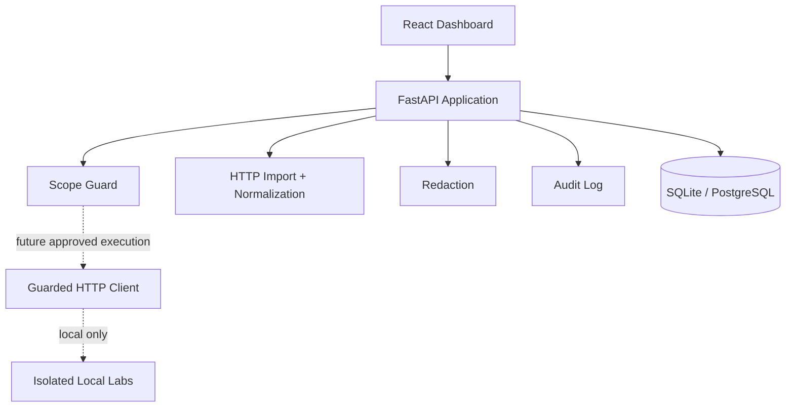
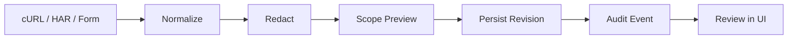

# WebHacking Lab

허가받은 웹 보안 분석을 한곳에서 기록하는 안전 중심 워크스페이스입니다. CTF, 로컬 Docker Lab, 명시적으로 승인된 모의해킹 범위에서 HTTP 요청을 정규화하고 민감정보를 마스킹하며, 대상 Scope와 감사 기록을 관리합니다.

> 현재 Phase 2까지 구현되었습니다. URL 크롤링이나 공격 요청은 아직 실행하지 않으며, 기본 상태는 항상 **Analysis Only**입니다.


## 지금 사용할 수 있는 기능

- 프로젝트와 워크스페이스 생성
- `localhost`, `127.0.0.1`, `::1` 기본 Scope 등록
- 외부 호스트 등록 시 권한 확인과 범위 설명 강제
- DNS/IP/경로/포트 기반 Scope Guard 미리 확인
- cURL 텍스트 및 HAR 파일 안전 가져오기
- 중복 Query 파라미터를 유지하는 HTTP 정규화
- Authorization, API Key, Cookie, JSON/Form 비밀값 자동 마스킹
- 요청 저장, 최초 Revision 생성, 요청 복제
- 모든 상태 변경과 정책 판단을 감사 로그로 기록
- 실제 FastAPI 데이터와 연결된 Projects 및 HTTP Repeater UI

| Scope 관리 | HTTP Repeater |
| --- | --- |
|  |  |

## 3분 빠른 시작

필요한 것은 Docker와 Docker Compose v2뿐입니다.

```bash
git clone https://github.com/MintKangaroo/WebHacking_Lab.git
cd WebHacking_Lab
cp .env.example .env
docker compose up --build
```

브라우저에서 다음 주소를 엽니다.

- 앱: <http://localhost:8080>
- API 문서: <http://localhost:8080/api/docs>
- 상태 확인: <http://localhost:8080/api/health>

8080 포트를 이미 사용 중이라면 `.env`에서 다음 값만 바꿉니다.

```dotenv
WEBHACKING_FRONTEND_PORT=28080
```

종료:

```bash
docker compose down
```

## 가장 간단한 사용 순서

1. 왼쪽 메뉴에서 **Projects**를 열고 `Local Lab`, `CTF`, `Authorized Pentest` 중 하나를 선택합니다.
2. 프로젝트 상세 화면에서 대상과 경로가 Scope에 포함되는지 **Check without sending**으로 확인합니다.
3. **HTTP Repeater**에서 cURL 또는 HAR를 붙여넣고 **Import safely**를 누릅니다.
4. 오른쪽에서 정규화된 요청과 `[REDACTED]` 처리 결과를 검토합니다.
5. 저장이 필요할 때만 **Save revision**을 켜고 프로젝트와 워크스페이스를 선택합니다.

예제 cURL:

```bash
curl 'http://127.0.0.1:5000/search?q=demo' \
  -H 'Authorization: Bearer demo-token'
```

이 문자열은 명령으로 실행되지 않습니다. 파서가 데이터로만 읽고 `Authorization` 값을 저장 전에 마스킹합니다.

## 안전 원칙

다음 경계는 코드와 UI에 적용됩니다.

- HTTP 요청 실행 기능은 현재 제공하지 않습니다.
- 분석 데이터와 네트워크 실행 계층을 분리합니다.
- cURL은 `shell`이나 subprocess로 실행하지 않습니다.
- `-k`, proxy, client certificate, 파일 기반 body/cookie 옵션을 import 단계에서 거부합니다.
- HAR 크기, 항목 수, 요청/응답 본문 크기를 제한합니다.
- URL userinfo와 HTTP(S) 이외 scheme을 거부합니다.
- 클라우드 메타데이터, link-local, multicast, unspecified, reserved 주소를 차단합니다.
- 모든 DNS 응답을 검사하고 향후 연결 고정에 사용할 IP 집합을 반환합니다.
- 외부 Scope에는 사용자의 권한 확인과 설명이 필요합니다.
- 민감정보는 DB, API 응답, 감사 로그에 들어가기 전에 다시 마스킹합니다.

인터넷 전체 스캔, 자격 증명 수집, 피싱, 악성코드, reverse shell, 파괴적 SQL, 서비스 거부, 대량 brute force, lateral movement는 구현 대상이 아닙니다. 자세한 내용은 [SECURITY.md](docs/SECURITY.md)와 [THREAT_MODEL.md](docs/THREAT_MODEL.md)를 참고하세요.

## 구조



분석 데이터 흐름:



```text
backend/                   FastAPI, domain, database, Scope Guard, tests
frontend/                  React/Vite dashboard, Projects, Repeater, tests
labs/                      격리된 학습 랩용 내부 Docker network
docs/                      아키텍처, 보안, 위협 모델, 스크린샷
.github/workflows/         backend/frontend/security CI
docker-compose.yml         non-root 로컬 실행 스택
```

구성 요소의 책임과 향후 Scanner/Static Analysis 결합 방식은 [ARCHITECTURE.md](docs/ARCHITECTURE.md)에 설명되어 있습니다.

## 주요 API

```text
GET    /api/health
GET    /api/version
GET    /api/dashboard/overview
POST   /api/projects
GET    /api/projects
GET    /api/projects/{project_id}
PATCH  /api/projects/{project_id}
DELETE /api/projects/{project_id}
POST   /api/projects/{project_id}/scope
GET    /api/projects/{project_id}/scope
POST   /api/projects/{project_id}/scope/check
POST   /api/workspaces
GET    /api/workspaces/{workspace_id}
PATCH  /api/workspaces/{workspace_id}
POST   /api/requests/import/curl
POST   /api/requests/import/har
POST   /api/requests
GET    /api/requests/{request_id}
POST   /api/requests/{request_id}/clone
GET    /api/responses/{response_id}
GET    /api/audit-events
```

전체 스키마와 요청 예시는 실행 후 `/api/docs`에서 확인할 수 있습니다.

## 로컬 개발

Python 3.12 이상과 Node.js 20 이상을 사용합니다.

```bash
make bootstrap
make backend-dev
```

새 터미널에서:

```bash
make frontend-dev
```

Vite는 `/api`를 `http://localhost:8000`으로 프록시합니다. 환경 변수와 안전한 기본값은 [.env.example](.env.example)에 있습니다.

DB migration:

```bash
cd backend
alembic upgrade head
```

## 테스트

```bash
# Backend: Ruff + mypy strict + pytest/coverage
docker build --target test -f backend/Dockerfile .

# Frontend
cd frontend
npm ci
npm run lint
npm run typecheck
npm run test
npm run build

# 실행 중인 Docker 앱을 대상으로 하는 로컬 E2E
npx playwright install chromium
PLAYWRIGHT_BASE_URL=http://127.0.0.1:8080 npm run e2e
```

현재 기준 Backend 53개 테스트와 85% 이상 coverage gate, Frontend 6개 unit 테스트와 Playwright E2E, coverage gate를 통과합니다. 테스트는 실제 외부 호스트에 요청을 보내지 않습니다.

## 설정

자주 사용하는 값:

| 변수 | 기본값 | 의미 |
| --- | --- | --- |
| `WEBHACKING_ANALYSIS_ONLY` | `true` | 분석 전용 모드 |
| `WEBHACKING_NETWORK_EXECUTION_ENABLED` | `false` | 전역 실행 차단 |
| `WEBHACKING_ALLOW_INSECURE_TLS` | `false` | 안전하지 않은 TLS 우회 차단 |
| `WEBHACKING_GLOBAL_REQUESTS_PER_MINUTE` | `30` | 향후 실행 전역 한도 |
| `WEBHACKING_DEFAULT_TARGET_CONCURRENCY` | `2` | 대상별 동시성 기본값 |
| `WEBHACKING_MAX_REQUEST_BYTES` | `1048576` | 요청 본문 상한 |
| `WEBHACKING_MAX_RESPONSE_BYTES` | `2097152` | 응답 본문 상한 |
| `WEBHACKING_MAX_HAR_BYTES` | `10485760` | HAR 입력 상한 |

## 지원 범위와 로드맵

현재는 취약점을 확정하는 단계가 아니라 안전한 분석 기반을 제공합니다. 다음 Phase에서 응답 Diff와 Security Header, CORS, JWT 구조, XSS context, Injection indicator 분석기를 추가합니다. 이후 React Flow 시각화, CTF Workspace, 5개 로컬 Lab, 보고서, URL Scanner, 소스코드 AST 분석, Hybrid PoC Verification 순서로 확장합니다.

최종 분석 범위에는 Injection, XSS, SSRF, Traversal, Upload, Access Control, Authentication/Session, JWT, CSRF, CORS, Header, Cache, Template, Deserialization, GraphQL/API 설정 문제의 관찰 및 방어 설명이 포함됩니다.

## 현재 제한

- Dashboard 지표는 UI 확인용으로 API가 제공하는 안전한 데모 데이터입니다.
- HTTP target으로 요청을 보내는 `/execute` 기능은 아직 없습니다.
- URL 크롤링, Active Scan, 소스 업로드/AST 분석, Finding/Report, Local Lab은 후속 Phase입니다.
- 정적·동적 분석 결과는 완전성을 보장할 수 없으므로 향후에도 증거, 신뢰도, 한계, 검증 상태를 함께 표시합니다.

## 기여 및 라이선스

작은 브랜치와 Conventional Commits를 사용하고, 보안 경계를 변경할 때는 abuse-case 테스트와 위협 모델을 함께 갱신해 주세요. 기존 Scope Guard, Redaction, Audit 경로를 우회하는 실행 경로는 허용하지 않습니다.

[MIT License](LICENSE)
