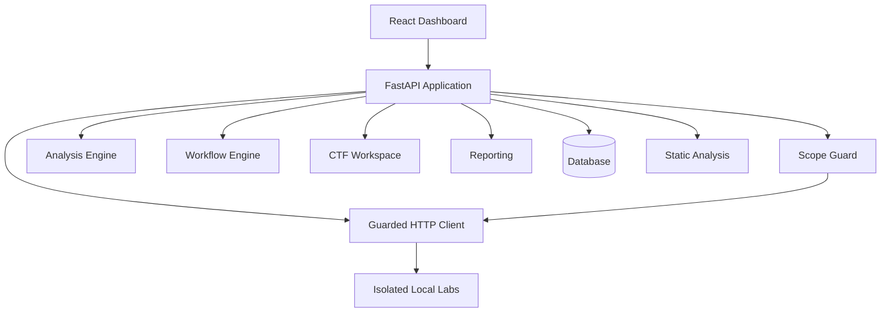
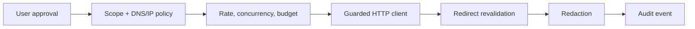

# WebHacking Lab

WebHacking Lab is a safety-first workspace for understanding web application
security in authorized pentests, CTF challenges, and isolated local labs. It
brings request analysis, evidence, hypotheses, visual data flow, learning
content, and reporting into one product without optimizing for indiscriminate
exploitation.

> **Phase 1 status:** the monorepo foundation, API-backed dashboard, database
> lifecycle, container runtime, safety defaults, tests, and CI are implemented.
> Request workspaces and Scope Guard are the next phase. Network execution is
> currently disabled.

## What exists today

- Responsive dark operations dashboard with metrics, charts, recent activity,
  safety posture, skeleton loading, error recovery, and a `Ctrl/⌘ + K` command
  palette.
- FastAPI health, version, OpenAPI, and dashboard endpoints.
- Pydantic settings with bounded request, concurrency, timeout, and response
  limits.
- SQLAlchemy 2 async engine lifecycle with SQLite by default and a PostgreSQL
  dependency option.
- Structured JSON logs and per-request correlation IDs.
- Non-root, capability-reduced Docker images and a dedicated internal network
  reserved for local training labs.
- Strict Python and TypeScript validation with backend and frontend CI.

The dashboard demonstration metrics come from the backend API and contain no
real targets, credentials, or tokens.

## Safety and ethics

Use this software only against systems you own or have explicit permission to
test. The finished product enforces allowlisted scope, redirect revalidation,
DNS/IP policy, bounded request budgets, user approval, secret redaction, and
audit events.

The following are out of scope by design: internet-wide scanning, credential
harvesting, phishing, malware delivery, reverse shells, persistent access,
session hijacking, destructive database operations, denial of service,
unbounded brute force, lateral movement, and cloud metadata credential access.

URL scanning, active tests, and PoC verification will all use the same guarded
HTTP execution path. Source uploads will be treated as untrusted data and will
never be executed or have dependencies installed automatically.

Read [SECURITY.md](docs/SECURITY.md) and
[THREAT_MODEL.md](docs/THREAT_MODEL.md) before enabling future execution
features.

## Architecture



Every future network-capable workflow crosses one enforcement chain:



See [ARCHITECTURE.md](docs/ARCHITECTURE.md) for component boundaries and the
URL Scan / Source Analysis / Hybrid Analysis extension plan.

## Analysis flow

```mermaid
flowchart LR
    IN[Request Input] --> N[Normalize]
    N --> RD[Redact]
    RD --> SV[Scope Validation]
    SV --> ST[Static Analysis]
    ST --> HY[Hypothesis]
    HY --> UA[User Approval]
    UA --> CR[Controlled Request]
    CR --> DF[Response Diff]
    DF --> EV[Evidence]
    EV --> FI[Finding]
    FI --> RE[Report]
```



## Project layout

```text
backend/                    FastAPI application and Python tests
frontend/                   React/Vite dashboard and component tests
labs/                       Isolated training network and future lab services
docs/                       Architecture, security, and threat model
.github/workflows/          Backend and frontend quality gates
docker-compose.yml          Hardened local application stack
```

## Quick start with Docker

Requirements: Docker Engine with Compose v2.

```bash
cp .env.example .env
docker compose up --build
```

Open:

- Dashboard: <http://localhost:8080>
- OpenAPI: <http://localhost:8080/api/docs>
- Health: <http://localhost:8080/api/health>

If port 8080 is occupied, set `WEBHACKING_FRONTEND_PORT` in `.env` and use
that port in the URLs above.

Stop the stack with:

```bash
docker compose down
```

The standard Compose profile does not start a vulnerable lab or make external
security test requests.

## Local development

Use Python 3.12+ and Node 20+.

```bash
make bootstrap
make backend-dev
```

In another terminal:

```bash
make frontend-dev
```

Vite proxies `/api` to `http://localhost:8000`. Configuration keys and their
safe defaults are documented in [.env.example](.env.example).

## API

Phase 1 endpoints:

```text
GET /api/health
GET /api/version
GET /api/dashboard/overview
GET /api/openapi.json
```

Example:

```bash
curl --fail http://localhost:8080/api/health
```

The response exposes the effective safety posture, but never secrets.

## Quality checks

Backend:

```bash
cd backend
ruff check .
ruff format --check .
mypy webhacking_lab
pytest --cov=webhacking_lab
```

Frontend:

```bash
cd frontend
npm run lint
npm run typecheck
npm run test
npm run build
```

The backend coverage gate is 85% and Phase 1 currently exceeds it.

## Planned capability sequence

1. Workspace and normalized HTTP models, import, redaction, and Scope Guard.
2. Analyzer contract, response diffing, findings, and at least six passive
   analyzers.
3. React Flow analysis and source-to-sink visualizations.
4. CTF workspace, encoding tools, and flag candidate management.
5. Five isolated, non-root local training labs.
6. Reports, auditing, E2E coverage, and hardening.
7. URL scanner foundation with bounded passive crawling and inventories.
8. User-approved safe active plugins and limited SQLi signal analysis.
9. Secure source upload, file/route indexing, and Monaco review.
10. AST-backed Flask analysis and parser-backed PHP analysis.
11. Hybrid route mapping and minimal policy-gated PoC verification.
12. Express, FastAPI, Django, Laravel, and Spring analysis.

Status language will distinguish static candidates, runtime candidates,
runtime-confirmed findings, manual review, false positives, and policy blocks.

## Limitations

Phase 1 does not yet import or send HTTP requests, create projects, scan URLs,
upload source, run labs, or generate findings. Disabled UI controls make that
boundary explicit. No analyzer claims are produced in this phase.

Static and dynamic analysis will remain inherently incomplete. Future findings
will include confidence, evidence, limitations, and validation state rather
than being presented as certainty.

## Contributing

Create a focused branch, keep execution logic behind the shared safety
services, add regression tests, and run both backend and frontend quality gates.
Use Conventional Commits. Security-sensitive changes should include abuse-case
tests and a threat-model update.

## License

[MIT](LICENSE)
