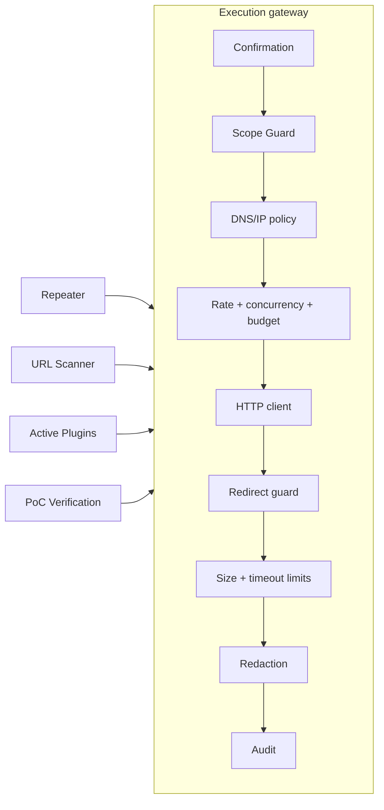
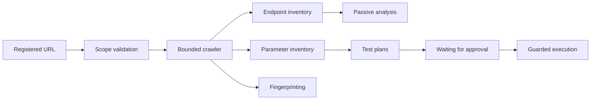
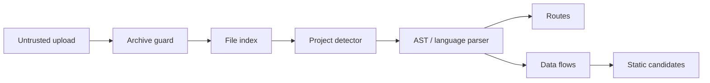
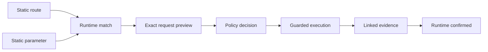

# Architecture

## Design goals

WebHacking Lab separates analysis, policy decisions, network execution,
untrusted source ingestion, and presentation. The separation is a security
boundary: an analyzer may propose a test but cannot send it.

The application is a React single-page client backed by a typed FastAPI API.
SQLAlchemy repositories own persistence, domain services own state transitions,
and routers only translate transport models.

## Current Phase 3 components

| Component | Responsibility |
| --- | --- |
| React workspace | Overview, Projects, Scope approval, Repeater, Diff, Analyzer Flow |
| FastAPI routers | System, project, workspace, scope, HTTP, execution, analysis, audit |
| Settings | Validated limits and safe-off execution defaults |
| Domain services | Project state, authorization, execution policy, analysis snapshots |
| Scope Guard | URL, scheme, authority, DNS/IP, target, port, and path decisions |
| HTTP import | Non-executing cURL/HAR parsing and multimap normalization |
| Redaction | Header, Cookie, query, JSON, form, text, and audit masking |
| Guarded HTTP client | DNS-pinned, TLS-verified, redirect-disabled single-hop sender |
| Request gateway | Exact preview, safe method policy, redirect checks, limits, budget |
| Diff engine | Dynamic normalization plus JSON, HTML, header, timing comparisons |
| Analysis engine | Six passive plugins with evidence, confidence, tests, limitations |
| Database | Async repositories, SQLite/PostgreSQL models, Alembic revisions |
| Request context | Correlation IDs and structured lifecycle logging |
| Containers | Non-root runtime, reduced capabilities, health checks |

## Execution boundary

The Repeater already calls the guarded gateway. Future scanners, active
plugins, and PoC verification must call the same service and may not instantiate
a general-purpose HTTPX client in feature code.

The redirect guard repeats scheme, hostname, DNS resolution, resolved IP, port,
and path checks for every hop. DNS answers are pinned for a request attempt to
reduce rebinding risk. Metadata, unexpected private ranges, non-loopback
link-local, multicast, and unspecified addresses are denied independently of
hostname allowlisting.

## URL scanner extension

Phase 8 adds a bounded job engine and inventory pipeline:

Profiles are capabilities, not cosmetic labels. `PASSIVE` does not create
mutations. `SAFE` permits only bounded non-destructive observations. `CTF`
requires explicit challenge confirmation. `LOCAL_LAB` additionally requires a
target identity issued by the isolated lab registry. Cancellation and request
budget checks occur before every queued request.

## Source analysis extension

Source input uses a separate ingestion boundary:

Uploaded code is never imported, interpreted, built, or executed. Dependency
installation is forbidden. Archive extraction uses a temporary isolated
directory, canonical path containment, file/count/size/depth budgets, and link
rejection. Secrets are displayed only in redacted form.

Language rules produce sources, transformations, sanitizers, sinks, and trace
gaps. Static candidates are not upgraded to runtime-confirmed findings without
evidence from the guarded execution path.

## Hybrid analysis

Hybrid mapping never guesses a hostname. A user-approved base URL is combined
with extracted static routes, then checked against runtime endpoint and
parameter inventories. Generated tests remain previews until individually
approved.

## Data storage

SQLite is the local default; PostgreSQL is optional. Large request, response,
and source artifacts will use a bounded artifact store rather than inline
database blobs. Credentials, cookies, authorization headers, API keys, and
session values are encrypted where persistence is required and redacted in
logs, UI payloads, reports, and audit metadata.
